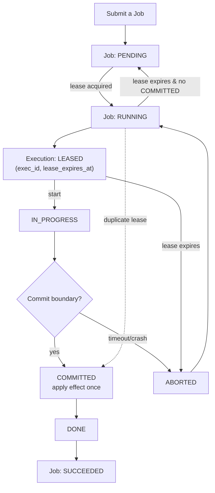

# State Model 

This document defines the minimum state required to enforce the invariants in [`invariants`](./01_invariants.md) and to model failures like [`FM_001`](../failure_modes/FM_001_duplicate_retry/spec.md).

---

## State Schematic

Key boundaries:
- **COMMITTED** is the only point where side effects may occur.
- Job state is derived from durable execution records, never guessed.

For the canonical non-failure flow, see [`happy_path`](./04_happy_path.md).

The system assumes **at-least-once delivery**. Duplicate delivery is expected.

--- 

## Entities 

### Job 
A unit of work identified by `job_id`.

Minimum fields:

- `job_id` (string, unique)
- `payload` (unknown)
- `state` (enum, see below)
- `attempt` (int, monotonically increasing)
- `created_at`, `updated_at` (timestamps)

### Execution
A single attempt to run a job, identified by `exec_id`.

Minimum fields:

- `exec_id` (string, unique)
- `job_id` (string, foreign key)
- `attempt` (int)
- `lease_owner` (worker_id)
- `lease_expires_at` (timestamp)
- `status` (enum, see below)
- `started_at`, `finished_at` (timestamps, nullable)

Executions are durable records used for:
- idempotency ([INV_001](./01_invariants.md#inv_001----job-execution-is-logically-idempotent))
- crash consistency ([INV_002](./01_invariants.md#inv_002----partial-execution-must-not-leave-irreversible-damage))
- auditability ([INV_003](./01_invariants.md#inv_003----job-state-transitions-are-monotonic-and-explicit))
- recovery ([INV_004](./01_invariants.md#inv_004----recovery-restores-correctness-not-just-availability))

--- 

## Job States 

Job state is a coarse, user-facing view **derived from executions** (aggregate projection, not an independent source of truth):

- `PENDING` : created, not yet leased 
- `RUNNING` : leased by some execution 
- `SUCCEEDED` : completed successfully
- `FAILED` : terminal failure 

Job state is computed from the set of execution records; we never mutate job state directly without an execution event.

--- 

## Execution Status (source of truth)

Execution status is the internal, durable source of truth:

- `LEASED`      : worker owns the lease until `lease_expires_at`
- `IN_PROGRESS` : worker started performing work 
- `COMMITTED`  : logical effect applied (idempotent boundary)
- `DONE`        : execution finished after commit  
- `ABORTED`     : lease expired or worker crashed before commit 

**COMMITTED** is the key boundary (see policy in [`policies`](./03_policies.md#commit-boundary-idempotency)):
- Side effects are allowed only at or after COMMITTED.
- Duplicate executions must short-circuit if a COMMITTED record already exists.

--- 

## Relationship of the two state machines

- The **execution state machine** is the authoritative, durable record (`LEASED → IN_PROGRESS → COMMITTED → DONE`, with failure `→ ABORTED`).
- The **job state machine** is an aggregate projection over executions (`PENDING ↔ RUNNING → SUCCEEDED/FAILED`). A job moves only when executions change; jobs have no direct transitions of their own.
- "Derived/aggregate" means job state is a pure function of execution rows (e.g., lease acquisition sets RUNNING; lease expiry with no COMMITTED reverts to PENDING; any DONE after COMMITTED yields SUCCEEDED).

--- 

## Allowed Transactions 

### Execution level transactions (Happy path)

- `LEASED` -> `IN_PROGRESS`
- `IN_PROGRESS` -> `COMMITTED`
- `COMMITTED` -> `DONE`

Failure paths:

- `LEASED` -> `ABORTED` (lease expires before start)
- `IN_PROGRESS` -> `ABORTED` (crash/timeout before commit)

A worker may only progress an execution it currently leases.

### Job level transitions (derived) 

- `PENDING` -> `RUNNING` when an execution is LEASED 
- `RUNNING` -> `SUCCEEDED` when any execution reaches DONE (after COMMITTED)
- `RUNNING` -> `PENDING` when lease expires and no execution is COMMITTED

--- 

## Idempotency rule (INV_001)

For a given `job_id`: 

- At most one execution may reach `COMMITTED`.
- Any later execution attempt must detect the committed record and no-op.

Implementation options (later):
- unique constraint on `(job_id, committed=true)`
- compare-and-set on `commit_record`
- dedicated `job_effects` table keyed by `job_id`

--- 

## Crash consistency rule (INV_002)

Work must be structured into two phases:

1. **Prepare phase** (safe to repeat)
  - compute results 
  - validate preconditions 
  - stage output

2. **Commit phase** (idempotent boundary)
  - atomically mark `COMMITTED`
  - apply logical effect exactly once 

If crash happens before COMMITTED:
- system may retry safely

If crash happens after COMMITTED but before DONE:
- recovery must finalize / reconcile to DONE without duplicating effects.

--- 

## How FM_001 happens in this model 

- Worker A leases `exec_id=A1` and starts work 
- Lease expires (timeout), system creates `exec_id=B1`
- Worker B leases `B1` and runs the same job 
- without the COMMITTED idempotency boundary, both apply effects 

FM_001 is prevented by enforcing:
- single COMMITTED execution per job_id 
- duplicate executions short-circuit at commit time 

--- 

## Minimal Implementation target (v0)

To keep scope tight, v0 requires only: 

- durable execution records 
- leasing with timeouts 
- a committed marker 
- a worker that can be killed mid-job 
- tests that reproduce FM_001 and prove the fix 
